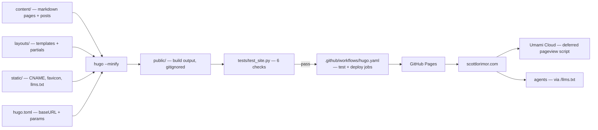

# Architecture — scottinabox-site

Static Hugo site. Sources build to `public/`, which deploys to GitHub Pages on every push to `main`.

## Notes

- Local dev runs `hugo server --buildDrafts`, production builds with `hugo --minify` (Hugo 0.165.0 extended in CI).
- CI runs the `test` job on pushes and pull requests. The `deploy` job runs on push to `main` only.
- `public/` is gitignored and rebuilt from scratch by every build and test run.
- Analytics renders only when `umamiWebsiteID` is set in `hugo.toml`. See `layouts/partials/analytics.html`.
